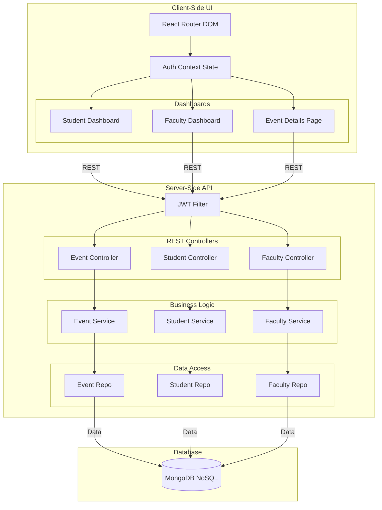
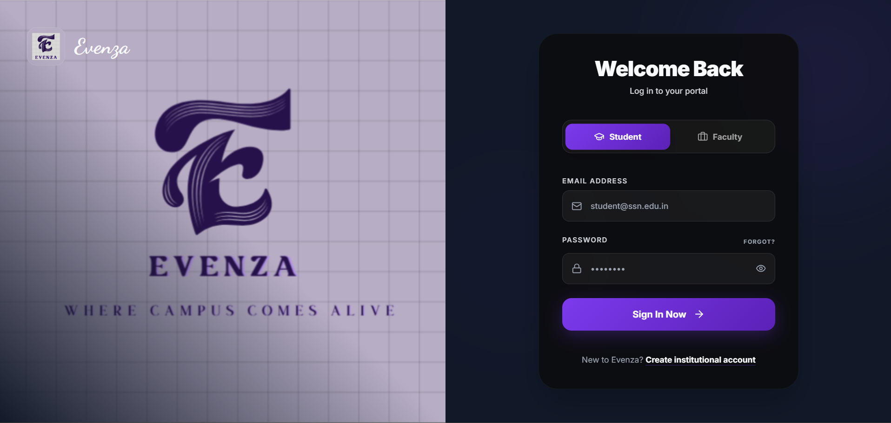

<div align="center">
  <h1>🎉 Evenzaa</h1>
  <p><strong>A Modern, Full-Stack Campus Event Management Platform</strong></p>
  
  [](https://reactjs.org/)
  [](https://vitejs.dev/)
  [](https://spring.io/projects/spring-boot)
  [](https://www.mongodb.com/)
  [](https://www.typescriptlang.org/)
  [](https://tailwindcss.com/)
</div>

<br />

## 🚀 About the Project

**Evenzaa** (StuEventManagement_Application) is a highly scalable, robust web platform designed to streamline the organization, management, and participation in campus events. By offering distinct portals for students and faculty members, it ensures a tailored experience for all users. 

Whether it's a technical symposium, a cultural fest, or a workshop, Evenzaa handles the entire lifecycle of an event from creation and approval to student registration and attendance tracking.

---

## 🏗 Architecture Diagram

The application follows a decoupled client-server architecture, using RESTful APIs to communicate between the React frontend and Spring Boot backend. 



[](https://evenzaa-m9ob.onrender.com/)

---


## ⚙️ Detailed Features & Operations

The platform is divided into domain-specific features driven by strict Role-Based Access Control (RBAC).

### 1. Student Portal
The Student Dashboard provides everything a student needs to explore and engage with campus activities.
- **Operations:**
  - **Login:** Secure JWT-based authentication using Roll Number and Password.
  - **Browse Events:** View all active events with real-time capacity and registration status.
  - **Filter Events:** Dynamically filter events by month and category.
  - **Event Registration:** Seamlessly register for an event (prevents double registration or registering when capacity is full).
  - **Cancel Registration:** Students can withdraw their registration from an event.
  - **Track History:** View a personalized list of *Registered Events* and *Cancelled Events*.

### 2. Faculty Portal
The Faculty Dashboard acts as the command center for event organizers and administrators.
- **Operations:**
  - **Login:** Secure JWT-based authentication using Faculty ID and Password.
  - **Create Event:** Fill out an intuitive form to publish a new event (requires Title, Date, Description, Venue, Capacity).
  - **Update Event:** Modify details of an existing event (restricted to the faculty member who originally created it).
  - **Delete/Cancel Event:** Completely remove an event from the platform (restricted to creator).
  - **Monitor Attendees:** (Internal logic) View the number of registered students vs total capacity.

### 3. Security & Core System
- **JWT Authorization:** Most API endpoints are protected. The server expects an `Authorization: Bearer <token>` header, decoding it to verify the user identity and enforce access rules (e.g., only Faculty can create events).
- **Automated Data Seeding:** On startup, the backend automatically seeds initial Faculty, Student, and Event data to provide an immediate out-of-the-box testing environment.

---

## 🛠️ Tech Stack

### Frontend
- **Framework:** React 18
- **Build Tool:** Vite
- **Language:** TypeScript
- **Styling:** Tailwind CSS
- **Routing:** React Router DOM v6
- **Animations:** Framer Motion
- **Icons:** Lucide React

### Backend
- **Framework:** Spring Boot 3.4.3
- **Language:** Java 17
- **Database:** MongoDB (Spring Data MongoDB)
- **Authentication:** JWT (jjwt)
- **Build Tool:** Maven

---

## 📂 Project Structure

A high-level overview of the repository structure:

```text
StuEventManagement_Application/
├── frontend/                          # React + Vite Frontend
│   ├── src/
│   │   ├── api/                       # Axios/Fetch API configurations
│   │   ├── assets/                    # Static assets (images, logos)
│   │   ├── components/                # Reusable UI components
│   │   ├── context/                   # Global state (AuthContext)
│   │   ├── hooks/                     # Custom React hooks
│   │   ├── pages/                     # Page components (Dashboards, Login, Details)
│   │   └── types/                     # TypeScript interfaces and types
│   ├── package.json
│   └── tailwind.config.js
│
├── src/main/java/com/example/stueventmanagement_application/  # Spring Boot Backend
│   ├── eventmanagement/               # Event domain logic (Controllers, Models, Services)
│   ├── facultymanagement/             # Faculty domain logic
│   └── studentmanagement/             # Student domain logic
│
├── pom.xml                            # Maven dependencies
└── README.md
```

---

## 🏁 Getting Started

Follow these instructions to get a copy of the project up and running on your local machine for development and testing.

### Prerequisites

- **Java Development Kit (JDK) 17** or higher
- **Node.js** (v18+ recommended)
- **Maven** (optional, uses wrapper `mvnw`)
- **MongoDB** running locally or via MongoDB Atlas

### Backend Setup

1. **Navigate to the backend root directory:**
   Ensure you are in the root directory where the `pom.xml` is located.

2. **Configure Database:**
   Update your `application.properties` or `application.yml` in `src/main/resources` with your MongoDB connection string if necessary. (By default it uses `localhost:27017`).

3. **Install Dependencies and Run:**
   ```bash
   # Using Maven Wrapper (Windows)
   mvnw spring-boot:run
   
   # Or using standard Maven
   mvn spring-boot:run
   ```
   The backend API will start on `http://localhost:8080`.

### Frontend Setup

1. **Navigate to the frontend directory:**
   ```bash
   cd frontend
   ```

2. **Install Node modules:**
   ```bash
   npm install
   ```

3. **Environment Variables:**
   Create a `.env` file in the `frontend` directory and add your API base URL:
   ```env
   VITE_API_URL=http://localhost:8080
   ```

4. **Start the development server:**
   ```bash
   npm run dev
   ```
   The frontend will be available at `http://localhost:5173`.

---

## 🔌 Comprehensive API Endpoints

The backend is modularized into three main domains. All endpoints (except login) require a valid JWT token.

### Authentication APIs
- `POST /students/login` - Authenticate student and receive JWT
- `POST /faculty/login` - Authenticate faculty and receive JWT

### Student APIs
- `GET /students/` - Fetch all students
- `GET /students/{rollNo}` - Fetch a specific student's details

### Faculty APIs
- `GET /faculty/` - Fetch all faculty members
- `GET /faculty/{facultyId}` - Fetch a specific faculty member's details

### Event APIs
- `GET /events/` - Retrieve all events
- `GET /events/{id}` - Get specific event details
- `GET /events/month/{month}` - Filter events by a specific month (1-12)
- `GET /events/student/{rollNo}` - Fetch all events a student is registered for
- `GET /events/cancelled/{rollNo}` - Fetch all events a student has cancelled

- `POST /events/` - Create a new event *(Faculty only)*
- `PUT /events/{id}` - Update event details *(Faculty only, must be creator)*
- `DELETE /events/{id}` - Cancel/Delete an event *(Faculty only, must be creator)*

- `POST /events/register/{eventId}/{rollNo}` - Register a student for an event
- `POST /events/cancel/{eventId}/{rollNo}` - Cancel a student's registration

---

## 🤝 Contributing

Contributions are what make the open source community such an amazing place to learn, inspire, and create. Any contributions you make are **greatly appreciated**.

1. Fork the Project
2. Create your Feature Branch (`git checkout -b feature/AmazingFeature`)
3. Commit your Changes (`git commit -m 'Add some AmazingFeature'`)
4. Push to the Branch (`git push origin feature/AmazingFeature`)
5. Open a Pull Request

---

<div align="center">
  <p>Built with ❤️ for Campus Event Management</p>
</div>
